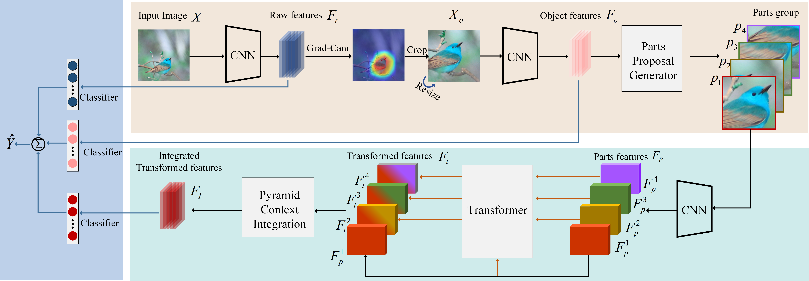

# CP-CNN [[paper]](https://ieeexplore.ieee.org/document/9656684)
This is the test codes of paper
Pytorch implementation of "***TIP2022-Cross-Part Learning for Fine-Grained Image Classification***"



## Requirement
   * python 3.6
   * pytorch 1.7
  


## Preparing Dataset and Model
Download the [CUB-200-2011](http://www.vision.caltech.edu/visipedia-data/CUB-200-2011/CUB_200_2011.tgz) datasets, You can also try other fine-grained datasets.

We provide the checkpoint model trained by ourselves, you can download it from [here](https://drive.google.com/file/d/1uhrj_-cWZmULIa2mgXWSHkDB1rTMZNWN/view?usp=sharing). If you test on our provided model, you will get a 92.27% test accuracy on CUB.

You can organize the provided model and datasets as follows: 
```
.
├── results/cub
│   ├── model_best.pth
├── CUB_200_2011
 ···
```

## Inference
If you want to test the **CP-CNN**, just run ``python test_cub.py``.


## Citation
If this work is helpful for you, please cite our paper.

```
@ARTICLE{9656684,
  author={Liu, Man and Zhang, Chunjie and Bai, Huihui and Zhang, Riquan and Zhao, Yao},
  journal={IEEE Transactions on Image Processing}, 
  title={Cross-Part Learning for Fine-Grained Image Classification}, 
  year={2022},
  volume={31},
  number={},
  pages={748-758},
  doi={10.1109/TIP.2021.3135477}}
```


## Reference
Parts of our codes based on:
* MGE-CNN from [lbzhang/MGE-CNN](https://github.com/lbzhang/MGE-CNN)
* NTS-Net from [yangze0930/NTS-Net](https://github.com/yangze0930/NTS-Net)

## Contact
If you have any questions about codes, please don't hesitate to contact us by manliu@bjtu.edu.cn or mliu04127@gmail.com.


